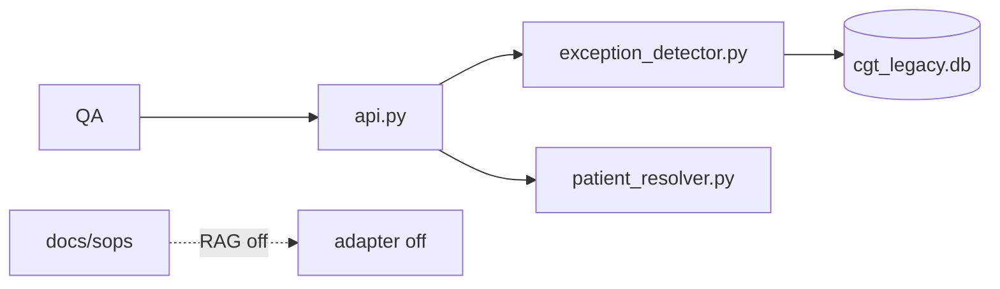

# Target C4 and RAG Design

**Case:** Cell & Gene Therapy (CGT) Patient-to-Batch Orchestration  
**Stage:** 10 — AI & Application Architecture  
**Participant status:** `COMPLETED`  
**Deliverable form:** Diagram + supporting table + rationale

## Stage question
How will the AI-enabled application consume context, integrate, deploy and fail safely?

## Why this artifact exists
Part of **Complete base AI/application architecture**. Policy stays in `status_rules.py`, not a model.

## Upstream dependency
`09_design_information_architecture/semantic-model-and-ontology.md`.

## Evidence to inspect
- `src/cgt_orchestrator/api.py`; `AGENTS.md`; `docs/03_architecture_current_state.md`

## Case challenge
Deterministic authorization outside model discretion; CLI degraded mode.

## Minimum content
C4 actors/trust boundaries; RAG component table.

## Relevant non-negotiable constraints
- AI cannot replace QA Release Authority. Shadow notes ≠ COI (EVAL-006).

## Working scaffold
### Diagram / model

### Supporting decisions
| Element / relationship | Responsibility / meaning | Evidence | Constraint / control |
|---|---|---|---|
| QA/COI human | Only release/merge actor | `AGENTS.md`; SOP-QA-014-v4 | No QMS write API |
| FastAPI + detector + resolver | Read; rank; identity evidence; HITL ack | `api.py`; `exception_detector.py`; `patient_resolver.py` | `autonomous_action=none`; CSV SoT; CORS demo |
| Optional RAG | Summarize **cited** SOP | `docs/sops/SOP-QA-014-v4.md` | **Off**; EVAL-006; never execute `shadow_ops/` |

| Component | Responsibility | Input/output | Policy/control | Trace/eval hook | Failure behavior |
|---|---|---|---|---|---|
| RAG (future) | Ground SOP to exception ids | evidence[] → snippets | Allowlist `docs/sops/` | EVAL-006 | Strip adapter |
| Detector (now) | Deterministic retrieve | SQLite/CSV → JSON | HITL | `tests/test_exception_intelligence.py` | Empty list OK |

**ADR:** RAG is not the exception engine (`docs/04_target_capabilities_not_prescribed_solutions.md`).

## Evidence and traceability
| Claim / decision | Evidence file + record / policy version / scenario | Upstream artifact | Confidence / limitation |
|---|---|---|---|
| Essential path local | `requirements.txt`; `VERIFICATION.md` | NFR-01 | High |

## Open issues / assumptions
| Issue / assumption | Why unresolved | Owner | Downstream impact | Closure evidence |
|---|---|---|---|---|
| No AuthN/Z | Demo | Security | No non-local bind | OpenAPI schemes |

## Completion check
- [x] Minimum content complete. Claims cited. Conflicts preserved. Decision rights distinct. No upstream contradiction. N/A unused.

## Handoff
**Stage exit contribution:** Complete base AI/application architecture
