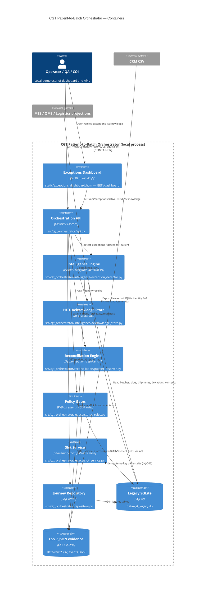

# Target C4 Container Diagram

**Case:** Cell & Gene Therapy (CGT) Patient-to-Batch Orchestration  
**Stage:** 10 — AI & Application Architecture  
**Participant status:** `COMPLETED`  
**Deliverable form:** Diagram + supporting table + rationale  
**ADRs:** ADR-001 state machines · ADR-002 HITL · ADR-003 local-first (`08_generate_test_and_select_options/preliminary-adrs.md`)

## Stage question
How will the AI-enabled application consume context, integrate, deploy and fail safely?

## C4 Container view (what this diagram is)
Level 2 of the C4 model. It shows the **deployable / runnable pieces** inside the CGT Orchestrator: how a user request hits FastAPI, which engines run, and which local stores they read. Policy (`status_rules.py`) stays **outside model discretion**. Degraded mode: CLI if uvicorn is down (`src/cgt_orchestrator/cli.py`). Optional LLM/RAG is **not a container in the baseline** (`requirements.txt`; ADR-003).

## Diagram / model

## Supporting decisions

| Container | Responsibility | Interface | Data store | Control point | Failure behavior |
|---|---|---|---|---|---|
| Exceptions Dashboard | Ranked HITL queue | `GET /dashboard`; fetch `/api/exceptions/active` | None | Acknowledge button disabled after receipt | Serve via uvicorn, not `file://` (`static/exceptions_dashboard.html`) |
| Orchestration API | HTTP façade, CORS demo-open | `/health`, `/identity/resolve`, `/api/*`, `/legacy/readiness` | — | Warning on readiness; no QMS write | 404 unknown patient; CLI fallback |
| Intelligence Engine | Observe / correlate / recommend | `detect_exceptions()` | SQLite + `data/raw/patients.csv` | Every row `requires_human_review=True` | Returns empty list only if DB missing — tests require seeded exceptions |
| HITL Acknowledge Store | Human saw the alert | `POST /api/exceptions/{id}/acknowledge` | Process memory | `effect_on_systems_of_record=none` | Lost on restart; exception still re-detected |
| Reconciliation Engine | Explainable identity | `resolve_patient()`; CLI `reconcile` | Three CSVs under `data/raw/` | Empty key on MRN collision; no `canonical_dob` | Unknown id → HITL, confidence 0.0 |
| Policy Gates | Deterministic SOP stops | `product_ready`, `patient_ready`, `excursion_*` | Caller-supplied rows | `QmsReleaseState` / `ConsentState` (ADR-001) | False on PENDING / WITHDRAWN; excursion review ≠ fail |
| Journey Repository | Evidence-backed reconstruction | `LegacyRepository.journey` | `data/cgt_legacy.db` | No invented transitions (EVAL-001) | Missing patient → API 404 |
| Data layer | Local projections | `paths.db_path()` | SQLite + CSV + `data/raw/events.jsonl` | CSV wins for identity (EVAL-002) | Rebuild from seed 42001; do not hand-edit challenge rows |

Runtime: `uvicorn cgt_orchestrator.api:app --app-dir src` (`requirements.txt`). CLI: `python -m cgt_orchestrator.cli diagnostics|reconcile|exceptions`.

## Evidence and traceability
| Claim / decision | Evidence file + record / policy version / scenario | Upstream artifact | Confidence / limitation |
|---|---|---|---|
| Containers map 1:1 to modules | `src/cgt_orchestrator/api.py` imports listed engines | ADR-002/003 | High |
| Data layer is SQLite **and** CSV, not JSON-only | `repository.py` SQLite; resolver CSVs; `events.jsonl` | `AGENTS.md` no single SoT | High |
| RAG is not a baseline container | `docs/04_target_capabilities_not_prescribed_solutions.md`; no vector store in `requirements.txt` | ADR-003 | Optional later, default off |

## Open issues / assumptions
| Issue / assumption | Why unresolved | Owner | Downstream impact | Closure evidence |
|---|---|---|---|---|
| Slot service is in-memory, not SQLite | Lab POC (`slot_service.py`) | Engineering | Not a live MES | HTTP `Idempotency-Key` in 90-day plan |
| Acknowledge store not durable | Process dict | Engineering | Weak audit | Persist + hash |

## Handoff
**Stage exit contribution:** Complete base AI/application architecture

Do not advance to Stage 11 until containers stay observe/recommend and policy gates remain deterministic.
