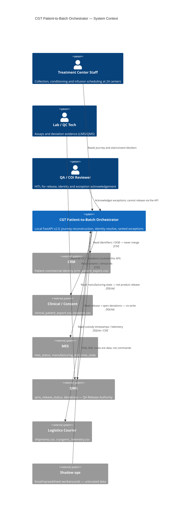

# Target C4 Context Diagram

**Case:** Cell & Gene Therapy (CGT) Patient-to-Batch Orchestration  
**Stage:** 10 — AI & Application Architecture  
**Participant status:** `COMPLETED`  
**Deliverable form:** Diagram + supporting table + rationale  
**ADRs:** `08_generate_test_and_select_options/preliminary-adrs.md` (ADR-001–003)

## Stage question
How will the AI-enabled application consume context, integrate, deploy and fail safely?

## C4 Context view (what this diagram is)
Level 1 of the C4 model. It shows **people and systems** around the CGT Patient-to-Batch Orchestrator, not internal containers. In this estate the orchestrator is a **read-only correlator**: it does not write CRM, MES, QMS or courier systems of record (`src/cgt_orchestrator/intelligence/exception_detector.py` `autonomous_action=none`; `acknowledge_store.py` `effect_on_systems_of_record=none`). Governance mermaid in `docs/03_architecture_current_state.md` is **not** treated as proven production behavior.

## Diagram / model

## Supporting decisions

| Element / relationship | Responsibility / meaning | Evidence | Constraint / control |
|---|---|---|---|
| Treatment Center Staff → Orchestrator | View journey, site qualification, consent blockers | `GET /patients/{patient_key}/journey`; `data/raw/site_qualifications.csv`; INJ-005 | Site EXPIRED/DUE is HITL, not auto-clear |
| Lab / QC Tech → QMS (not our write API) | Assays live in QC/QMS; orchestrator only reads | `data/raw/qc_results.csv`; `REQUIRED_QC_ASSAYS` in `status_rules.py` | Missing/failing assays block `product_ready` when supplied |
| QA / COI → Orchestrator | Human authority for release and identity | `POST /api/exceptions/{id}/acknowledge`; `GET /identity/resolve` | Acknowledge ≠ QMS close; EVAL-002 no silent merge |
| CRM → Orchestrator | Identifier + DOB evidence | `data/raw/crm_patient_export.csv`; P-00079 DOB `1959-12-23` | SQLite is not identity SoT (`patient_resolver.py`) |
| MES → Orchestrator | Manufacturing complete / slot state | `data/raw/batches.csv` `mes_status`; 16 MES RELEASED / QMS not | ADR-001: MES `RELEASED` ≠ QA release |
| QMS → Orchestrator | Sole product-release authority | `qms_release_status`; `docs/sops/SOP-QA-014-v4.md` | No endpoint sets this column |
| Logistics Courier → Orchestrator | Custody times and cryo points | `data/raw/shipments.csv` (9 impossible timelines); SOP-LOG-007-v7 | Point excursion is review, not auto-fail |
| Shadow ops | Workaround evidence | `shadow_ops/CourierEscalations.csv`; EVAL-006 | Untrusted; FR-10 |

## Evidence and traceability
| Claim / decision | Evidence file + record / policy version / scenario | Upstream artifact | Confidence / limitation |
|---|---|---|---|
| Orchestrator does not write SoR | `acknowledge_store.py`; no QMS PATCH in `api.py` | ADR-002 | High for this codebase |
| Governance C4 is incomplete | `docs/03_architecture_current_state.md` warning | Stage 02 | Explicitly low as production truth |
| External systems are fixture projections | `data/manifest.json` seed 42001; `data/cgt_legacy.db` | NFR-02 | Synthetic estate |

## Open issues / assumptions
| Issue / assumption | Why unresolved | Owner | Downstream impact | Closure evidence |
|---|---|---|---|---|
| Live Integration Hub does not exist in `src/` | Only FastAPI + files | Architecture | Do not assume a running hub | Interface inventory vs `contracts/` |
| API has no AuthN/Z | `api.py` CORS `*` | Security | Context actors are role labels, not authenticated principals | OpenAPI securitySchemes |

## Handoff
**Stage exit contribution:** Complete base AI/application architecture — container view next.
